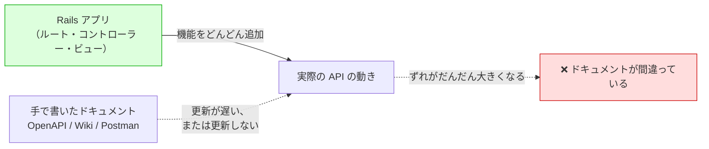
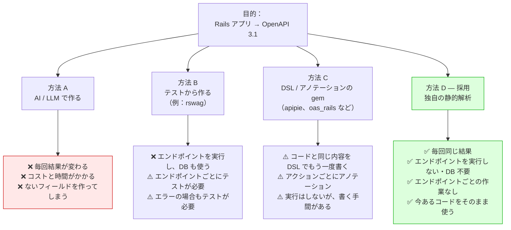
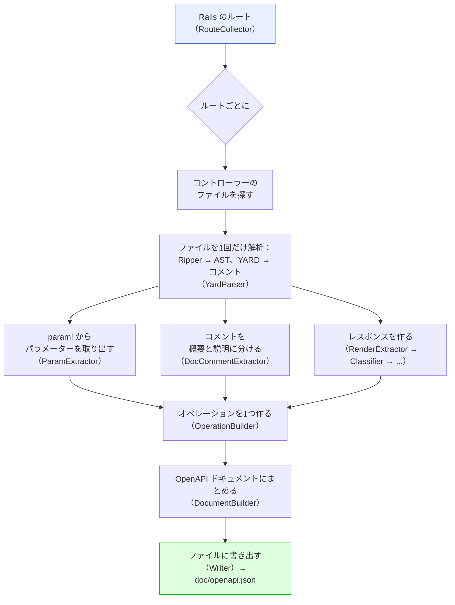
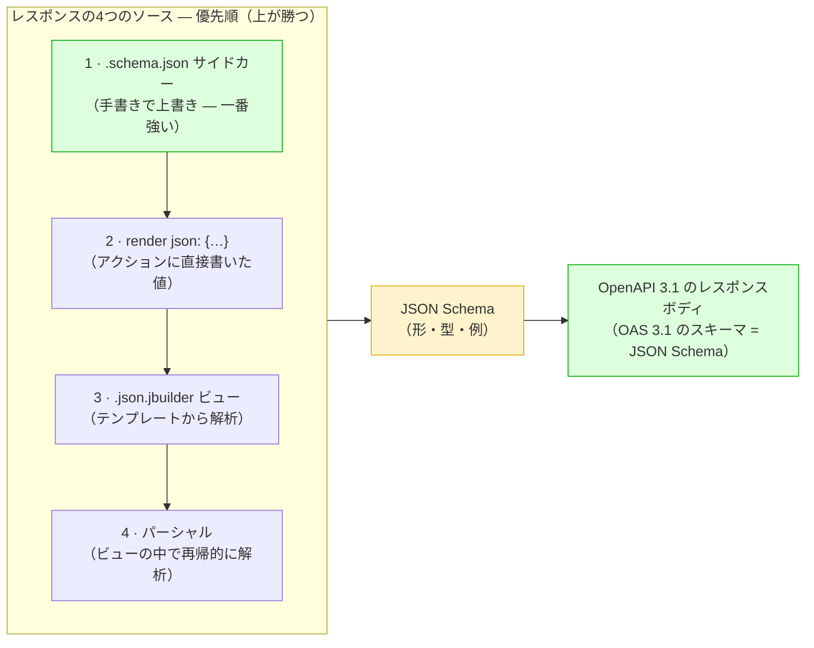
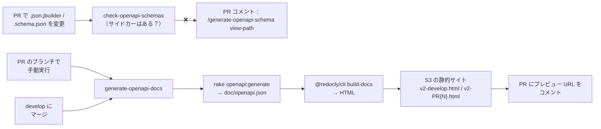

# rails-openapi-generator — アプローチと設計

> Rails アプリのソースコードを**静的に解析**して、OpenAPI 3.1 のドキュメントを作ります。コントローラーのコードは実行しません。

- **アジェンダ（30分）：** 背景（4）・検討した方法（8）・仕組み（5）・詳しい説明（9）・CI とデプロイ（3）・まとめ（1）
- 📖 GitBook のドキュメント：**[日本語](https://tonystrawberry.gitbook.io/rails-openapi-generator-ja)** · **[English](https://tonystrawberry.gitbook.io/rails-openapi-generator)**

---

## 1. 背景 — 何が問題か
**API ドキュメントが、コードとずれていく。**

- 本当の情報はいつも Rails アプリの中にある：ルート、パラメーター、レスポンスの形
- でもドキュメントは別の場所にある：手書きの YAML、Postman、Wiki
- 同じ情報のコピーが2つあると、片方は必ず古くなる



### 困っていること

- **手書きのドキュメントはすぐ古くなる：** フィールドを追加するたびに別の場所も直す必要があり、レビューでも見落としやすい
- **使う人がドキュメントを信じなくなる：** 一度間違っていると、フロントエンドやモバイルのチームはソースコードを直接読むようになる
- **古いエンドポイントにはドキュメントがまったくない：** 何百個も手で書き直す時間は、いつまでも取れない
- **情報はもうコードの中にある：** `param!`、`.json.jbuilder`、`render json:`、`rescue_from`。ただ OpenAPI の形になっていないだけ

### ポイント

> **Rails のソースコードそのものが仕様書。** 別のコピーを手で合わせるのではなく、毎回コードから作り直す。

- **古いエンドポイントの問題も解決：** 1回実行するだけで、すべてのルートのドキュメントができる。エンドポイントごとの作業はゼロ
- **良いサイクルが生まれる：** ドキュメントを良くするには、コードを良くすればいい（`param!`、YARD コメント、正しいビュー）

---

## 2. 検討した方法


### 方法 A — AI / LLM で作る（前に試した）

- **毎回結果が変わる：** 同じコントローラーでも実行するたびにスキーマが変わるので、PR で差分を見られない
- **コストと時間：** 毎回コード全体をモデルに読ませるのは、遅くてお金がかかる
- **ないものを作る：** 存在しないフィールドを追加したり、本当にあるフィールドを消したりする
- 仕様書は**契約**なので、正確で、毎回同じでなければならない

### 方法 B — テストから作る（[rswag](https://github.com/rswag/rswag)）

- ✅ 本当にリクエストを実行するので、書かれた形と実際の形が同じになる
- ❌ CI でアプリを起動し、DB を使い、ユーザーをログインさせ、すべてのエンドポイントを実行する必要がある
- ❌ ドキュメントのためにテストを書くことになり、メンテナンスするものが増える
- ❌ エラー（`404`、`422`）は、エラー用のテストを書かないと出てこない
- ❌ **一番の問題：** **今あるすべてのコントローラー**にテストを書く必要があり、現実的ではない

```ruby
# spec/requests/users_spec.rb
RSpec.describe "Users API", type: :request do
  path "/users/{id}" do
    get "Retrieves a user" do
      produces "application/json"
      parameter name: :id, in: :path, type: :integer, required: true

      response "200", "user found" do
        schema type: :object,
               properties: { id: { type: :integer }, name: { type: :string }, email: { type: :string } }
        run_test!   # actually boots the app and hits the endpoint
      end
    end
  end
end
```

### 方法 C — DSL / アノテーションの gem

- **[apipie-rails](https://github.com/Apipie/apipie-rails)：** アクションの上に DSL を書く（`api`、`param`、`returns`）
- **[oas_rails](https://github.com/a-chacon/oas_rails)：** コメントのタグを書く（`# @summary`、`# @parameter`）。マウントしたエンジンが表示する
- **[swagger-blocks](https://github.com/swagger-api/swagger-blocks) / [swagger_yard](https://github.com/livingsocial/swagger_yard-rails)：** スキーマを Ruby の DSL ブロックや YARD タグで手書きする
- ✅ どれもエンドポイントを実行しないし、DB も使わない
- ❌ でもどれも、**コントローラーにもう書いてある内容を、アクションごとにもう一度書く**必要がある
- ❌ だから古いエンドポイントの問題は解決しない：結局すべてのアクションを触ることになる

同じ「ユーザーを表示する」エンドポイントの例：

```ruby
# apipie-rails
api :GET, "/users/:id", "Show a user"
param :id, :number, required: true, desc: "User ID"
returns code: 200, desc: "The user" do
  property :id,    Integer
  property :name,  String
  property :email, String
end
def show
  render json: @user
end
```

```ruby
# oas_rails
# @summary Show a user
# @parameter id(path) [Integer] The user ID
# @response User found(200) [Hash{id: Integer, name: String, email: String}]
def show
  render json: @user
end
```

```ruby
# swagger-blocks
swagger_path "/users/{id}" do
  operation :get do
    key :summary, "Show a user"
    parameter do
      key :name, :id
      key :in, :path
      key :required, true
      key :type, :integer
    end
    response 200 do
      key :description, "user found"
      schema do
        property(:id)    { key :type, :integer }
        property(:name)  { key :type, :string }
        property(:email) { key :type, :string }
      end
    end
  end
end
```

**この gem では、どれも必要ありません。** 普通のコントローラーだけで大丈夫：

```ruby
# Show a user
def show
  render json: @user   # or a users/show.json.jbuilder view
end
```

### 方法 D — 独自の静的解析（この gem）✅

**コードを読むだけで、実行はしない。**

| 項目 | AI | テスト（rswag） | DSL/アノテーションの gem | **静的解析（この gem）** |
|---|---|---|---|---|
| 毎回まったく同じ結果になる | ❌ | ⚠️ | ✅ | ✅ |
| エンドポイントを実行しない・DB 不要 | ✅ | ❌ | ✅ | ✅ |
| エンドポイントごとに書く作業がない | ✅ | ❌ | ❌ | ✅ |
| 今あるコードをそのまま使う | ✅ | ❌ | ❌ | ✅ |
| エラーのレスポンスも自動で書ける | ❌ | ❌ | ❌ | ✅ |
| CI でのコスト・時間 | 高い | 高い | 低い | 低い |
| 正確さ（ないフィールドを作らない） | ❌ | ✅ | ✅ | ✅ |
| 社内でツールをメンテナンスしなくていい | ✅ | ✅ | ✅ | ⚠️（自分たちで管理） |

- **Rails の起動について：** どの方法も Rails の環境を読み込む
  - エンドポイントを実行して DB を使うのは rswag だけ
  - この gem が Rails を読み込むのは**ルートの一覧**を取るためだけ。あとはすべてソースコードの静的解析

**受け入れているデメリット**

- **見えるのは、コードにそのまま書いてある値だけ：** `render json: User.first.serializable_hash` は「何でもいい」（`{}`）になる。足りないところはサイドカーで補う
- **メンテナンス：** 独自のツールなので、自分たちで管理する（レスポンス関係だけで約1,000行）
  - まったく新しい書き方のコントローラーが出てきたら、gem の修正が必要になるかもしれない
  - **今と同じ書き方でコントローラーを作っていれば、gem の修正は必要ない**
  - 対応していない書き方でも、ゆるいスキーマになるだけで、ビルドは失敗しない

**作り方：AI が開発、人間がチェック**

- この gem は**ほとんど AI が書いた**。私の役割は **QA**（機能を決める、レビューする、確認する）
- 「自由に任せる」やり方にしても安全だった理由：
  - **独立したライブラリ：** メインのアプリに影響がない
  - **テストしやすい：** Rails のソースを入れる → OpenAPI のドキュメントが出る
- **テストが安全ネット：** フィクスチャのテスト（テスト用の Rails アプリ＋期待する出力）で、改善するたびに壊れていないか確認できる

---

## 3. gem の仕組み — 全体像
**1つのルートを入れる → 1つの OpenAPI オペレーションが出る。** 全体は1つの `Generator` がまとめて動かす。



### 2つのパーサー

- **[Ripper](https://docs.ruby-lang.org/en/master/Ripper.html)：** Ruby に最初から入っている。ソースコードをツリー（AST）に変える。追加の依存なし
- **[YARD](https://yardoc.org/)：** メソッドの上のコメントを読むためだけに使う

### データはどこから来るか

| OpenAPI の部分 | Rails のソース |
|---|---|
| パスと HTTP メソッド | Rails のルート一覧 |
| `summary` / `description` | アクションの上の YARD コメント |
| パラメーターとリクエストボディ | `param!`（ネストした `Hash` ブロックも含む） |
| レスポンスボディ | 優先順：`.schema.json` サイドカー › `render json:` › `.json.jbuilder` ビュー › パーシャル |
| ステータスコード | `head`、`render status:`、`redirect_to`、または HTTP メソッドのルール |
| エラーのレスポンス | コントローラーの継承チェーンにある `rescue_from` |

### 設計のルール

- **警告はするが、エラーで止まらない：** 1つのコントローラーが壊れていても、他の99個のドキュメントはちゃんとできる
- **毎回同じ結果：** 同じソースなら、1バイトも違わない出力になる。だから仕様書をコミットして差分を見られる
- **シンプル：** 役割が1つずつの小さいファイルが約30個。1つの `Generator` でわかりやすくつないでいる

---

## 4. 詳しい説明
### 4.1 最初から最後まで：1つのアクション → OpenAPI オペレーション

- 実際のアクションとビューを使って、各ステージの出力を見ていく
- 出力はすべて、この入力で gem のクラスを実際に動かした結果

**入力**

```ruby
# app/controllers/api/articles_controller.rb
class Api::ArticlesController < ApplicationController
  # Search articles
  # Returns published articles matching the given filters, newest first.
  def index
    param! :q,        String,  blank: false, description: "Free-text search"
    param! :per_page, Integer, in: 1..100, required: false, description: "Page size"
  end
end
```

```ruby
# app/views/api/articles/index.json.jbuilder
json.array! @articles do |article|
  json.id article.id
  json.title article.title
  json.status "published"
  json.author do
    json.name article.author_name
  end
end
```

**ステージ 1 — YARD → `DocComment`**

- YARD が返すのは、コメントのテキストだけ
- gem の `DocCommentExtractor` がそれを分ける：1行目 = 概要（summary）、残り = 説明（description）
- `DocComment` は gem が自分で定義した構造体で、YARD のものではない

```ruby
# ── Input: YARD docstring (object.docstring.to_s) ──
"Search articles\nReturns published articles matching the given filters, newest first."

# ── Output: DocCommentExtractor ──
#<DocComment
  summary="Search articles",
  description="Returns published articles matching the given filters, newest first.">
```

**ステージ 2 — `ParamExtractor`：Ripper の AST → `ParamCall`**

- `param!` のノードから、名前（シンボル）、型（定数）、オプションのハッシュを読む
- `LiteralEvaluator` が値を Ruby の値に変える（`1..100` → `Range`）
- 値ではない式は `UNRESOLVED` になる：そのオプションは使わず、`fully_resolved` が `false` になり、警告が出る
- 定数は読める（`Order::STATUSES` → enum）が、`.sort` のような式は読めない

```ruby
# ── Input: param! :q, String, blank: false, description: "Free-text search" ──
[:command,
 [:@ident, "param!", [1, 0]],
 [:args_add_block,
  [[:symbol_literal, [:symbol, [:@ident, "q", [1, 8]]]],       # name → "q"
   [:var_ref, [:@const, "String", [1, 11]]],                   # type → "String"
   [:bare_assoc_hash,                                          # options → LiteralEvaluator
    [[:assoc_new, [:@label, "blank:", [1, 19]], [:var_ref, [:@kw, "false", [1, 26]]]],
     [:assoc_new, [:@label, "description:", [1, 33]],
      [:string_literal, [:string_content, [:@tstring_content, "Free-text search", [1, 47]]]]]]]],
  false]]
# ── Output ──
#<ParamCall name="q", type="String", required=false,
  constraints={:blank=>false, :description=>"Free-text search"}, fully_resolved=true, nested=nil>


# ── Input: param! :per_page, Integer, in: 1..100, required: false, description: "Page size" ──
[:command,
 [:@ident, "param!", [1, 0]],
 [:args_add_block,
  [[:symbol_literal, [:symbol, [:@ident, "per_page", [1, 8]]]],   # name → "per_page"
   [:var_ref, [:@const, "Integer", [1, 18]]],                     # type → "Integer"
   [:bare_assoc_hash,                                            # options → LiteralEvaluator
    [[:assoc_new, [:@label, "in:", [1, 27]],
      [:dot2, [:@int, "1", [1, 31]], [:@int, "100", [1, 34]]]],   # :dot2 range → 1..100
     [:assoc_new, [:@label, "required:", [1, 39]], [:var_ref, [:@kw, "false", [1, 49]]]],
     [:assoc_new, [:@label, "description:", [1, 56]],
      [:string_literal, [:string_content, [:@tstring_content, "Page size", [1, 70]]]]]]]],
  false]]
# ── Output ──
#<ParamCall name="per_page", type="Integer", required=false,
  constraints={:in=>1..100, :description=>"Page size"}, fully_resolved=true, nested=nil>
```

- `[1, 15]` のような数字は、ソースの位置：`[行, 列]`

**ステージ 3 — `SchemaMapper`：`ParamCall` → スキーマ**

- `blank: false` → `minLength: 1`
- `in: 1..100` → `minimum` / `maximum`

```ruby
q        → {"type"=>"string",  "minLength"=>1, "description"=>"Free-text search"}
per_page → {"type"=>"integer", "minimum"=>1, "maximum"=>100, "description"=>"Page size"}
```

**ステージ 4 — `JbuilderParser`：ビューの AST → レスポンスのスキーマ**

- テンプレートを Ripper で解析する。実行はしない
- `json.array!` ＋ブロック → 配列
- `json.<key> <そのままの値>` → 型と `example` がつく
- `json.<key> <実行時の値>` → `{}`（何でもいい）
- `json.<key> do … end` → ネストしたオブジェクト
- `if` / `else` / `case` の分岐はまとめる：すべての分岐のプロパティが入る

```ruby
# ── Input: the view's Ripper AST (trimmed; `...` = omitted slots) ──
[:method_add_block,
 [:command_call,                                             # json.array! @articles
  [:vcall, [:@ident, "json", [1, 0]]], [:@period, ".", [1, 4]],
  [:@ident, "array!", [1, 5]],                               # array! → { type: array }
  [:args_add_block, [[:var_ref, [:@ivar, "@articles", [1, 12]]]], false]],
 [:do_block,
  [:block_var, [:params, [[:@ident, "article", [1, 26]]], ...], false],
  [:bodystmt,
   [[:command_call,                                          # json.id article.id
     [:vcall, [:@ident, "json", [2, 2]]], [:@period, ".", [2, 6]],
     [:@ident, "id", [2, 7]],                                # key "id"
     [:args_add_block,
      [[:call, [:var_ref, [:@ident, "article", ...]], [:@period, "."], [:@ident, "id", ...]]],  # runtime → {}
      false]],
    [:command_call,                                          # json.title article.title
     [:vcall, [:@ident, "json", [3, 2]]], [:@period, "."], [:@ident, "title", [3, 7]],
     [:args_add_block, [[:call, ...article.title... ]], false]],   # runtime → {}
    [:command_call,                                          # json.status "published"
     [:vcall, [:@ident, "json", [4, 2]]], [:@period, "."], [:@ident, "status", [4, 7]],
     [:args_add_block,
      [[:string_literal, [:string_content, [:@tstring_content, "published", [4, 15]]]]],  # literal → typed + example
      false]],
    [:method_add_block,                                      # json.author do ... end
     [:call, [:vcall, [:@ident, "json", [5, 2]]], [:@period, "."], [:@ident, "author", [5, 7]]],
     [:do_block, nil,
      [:bodystmt,
       [[:command_call,                                      # json.name article.author_name
         [:vcall, [:@ident, "json", [6, 4]]], [:@period, "."], [:@ident, "name", [6, 9]],
         [:args_add_block, [[:call, ...article.author_name... ]], false]]],  # runtime → {}
       ...]]]],
   ...]]]
# ── Output ──
{
  "type": "array",
  "items": {
    "type": "object",
    "properties": {
      "author": { "type": "object", "properties": { "name": {} } },
      "id": {},
      "status": { "type": "string", "example": "published" },
      "title": {}
    }
  }
}
```

**ステージ 5 — `OperationBuilder`：1つのルート → `Endpoint`**

- ルートごとに1回動く。gem の中で使う構造体を作る（まだ OpenAPI の JSON ではない）
- 各パラメーターの場所を決める：パス、クエリ、ボディ（`GET` ならクエリ）
- `description` をスキーマの中から、パラメーター自体に移す
- ソースの場所、`operationId`、コントローラーのタグをつける

```ruby
# ── Input ──
route           = Route(GET "/api/articles" → api/articles#index)
doc_comment     = DocComment(...)                          # Stage 1
param_calls     = [ParamCall(q …), ParamCall(per_page …)]  # Stage 2
response        = Response(200, body: <jbuilder schema>)   # Stage 4
source_location = "app/controllers/api/articles_controller.rb:4"

# ── Output ──
#<struct Endpoint
 http_method="GET",
 path="/api/articles",
 summary="Search articles",
 description="Returns published articles matching the given filters, newest first.\n\n" +
             "_Source: `app/controllers/api/articles_controller.rb:4`_",
 parameters=
  [#<struct Parameter name="q", location=:query, required=false,
     schema={"type"=>"string", "minLength"=>1},             # description moved out of schema…
     description="Free-text search">,                       # …onto the parameter
   #<struct Parameter name="per_page", location=:query, required=false,
     schema={"type"=>"integer", "minimum"=>1, "maximum"=>100},
     description="Page size">],
 request_body=nil,                                          # GET → no body
 operation_id="get_api_articles",
 tag="Api::ArticlesController",
 response=
  #<struct Response kind=:json, description="Successful response",
    entries=[#<struct ResponseEntry status=200, body={"type"=>"array", "items"=>{…}}, content_types=nil>]>>
```

**ステージ 6 — `DocumentBuilder`：すべての `Endpoint` → OpenAPI ドキュメント**

- アプリ全体で1回だけ動く
- 一番上の `openapi`、`info`、`tags` を追加する
- パスごと、メソッドごとにまとめて、すべて並べ替える（パラメーターは名前順）。だから毎回同じ出力になる
- `:id` → `{id}` に変えて、コンテンツタイプつきの `responses` を作る

```ruby
# ── Input ──
endpoints = [Endpoint(GET /api/articles), …]   # one per route, from Stage 5
configuration.title = "My API"                 # api_version defaults to "1.0.0"
```

```json
{
  "openapi": "3.1.0",
  "info": { "title": "My API", "version": "1.0.0" },
  "tags": [{ "name": "Api::ArticlesController" }],
  "paths": {
    "/api/articles": {
      "get": {
        "operationId": "get_api_articles",
        "tags": ["Api::ArticlesController"],
        "summary": "Search articles",
        "description": "Returns published articles matching the given filters, newest first.\n\n_Source: `app/controllers/api/articles_controller.rb:4`_",
        "parameters": [
          {
            "name": "per_page",
            "in": "query",
            "required": false,
            "description": "Page size",
            "schema": { "type": "integer", "minimum": 1, "maximum": 100 }
          },
          {
            "name": "q",
            "in": "query",
            "required": false,
            "description": "Free-text search",
            "schema": { "type": "string", "minLength": 1 }
          }
        ],
        "responses": {
          "200": {
            "description": "Successful response",
            "content": {
              "application/json": {
                "schema": {
                  "type": "array",
                  "items": {
                    "type": "object",
                    "properties": {
                      "author": { "type": "object", "properties": { "name": {} } },
                      "id": {},
                      "status": { "type": "string", "example": "published" },
                      "title": {}
                    }
                  }
                }
              }
            }
          }
        }
      }
    }
  }
}
```

- すべてのフィールドは、コントローラーかビューに書いてあるコードから来ている
- 解析で足りない場合は、サイドカーで `200` のボディを上書きできる（§4.4）

### 4.2 レスポンスに JSON Schema を使う理由



**優先順（上が勝つ）**

1. **サイドカー：** すべてを上書きする
2. **`render json:`：** ビューより強い（より具体的だから）
3. **`.json.jbuilder` ビュー：** 上の2つがないときに使う
4. **パーシャル：** ビューの中で解析される。別のソースではない

**JSON Schema を使う理由**

- **OpenAPI 3.1 のスキーマは JSON Schema そのもの：** 変換がいらない
- **データなしで形を表せる：** コードを実行しない私たちに、ちょうど合っている
- **上書き用のフォーマットとしても自然：** 手書きのサイドカーと、解析したスキーマを入れ替えられる

**JSON Schema はどんなものか**

- JSON のレスポンスは*データ*：具体的な例が1つ

```json
{ "id": 42, "email": "alice@example.com", "role": "admin" }
```

- JSON Schema は、正しいレスポンスすべての*形*を表す

```json
{
  "type": "object",
  "required": ["id", "email"],
  "properties": {
    "id":    { "type": "integer", "minimum": 1, "example": 42 },
    "email": { "type": "string", "format": "email", "example": "alice@example.com" },
    "role":  { "type": "string", "enum": ["admin", "member"] }
  }
}
```

- `type`：値の種類（object、string、integer、array など）
- `required`：必ずあるフィールド
- `format`、`enum`、`minimum`：値についての追加のルール
- `example`：ドキュメントに表示するサンプルの値
- `.schema.json` サイドカーに書くのも、これとまったく同じ形（§4.4）

**同じようなスキーマを、jbuilder ビューから作る**

```ruby
# app/views/api/users/_user.json.jbuilder
json.extract! user, :id, :name, :email
json.role "member"
json.profile do
  json.bio user.bio
end
```

```json
{
  "type": "object",
  "properties": {
    "id":    {},
    "name":  {},
    "email": {},
    "role":    { "type": "string", "example": "member" },
    "profile": {
      "type": "object",
      "properties": { "bio": {} }
    }
  }
}
```

- そのままの値（`"member"`）→ 型と例がつく
- 実行時のデータ（`user.bio`、`extract!`）→ `{}`：わからないことは、わからないと正直に書く

### 4.3 コードを追いかける：エラーのレスポンスも自動で

- `render` は、ヘルパー、`before_action`、`rescue_from` の中にあることが多い
- gem はコントローラーの継承チェーン（concern も含む）をたどって、設定した深さまで追いかける
- 呼び出すときのそのままの引数は、ヘルパーの中まで渡される

```ruby
rescue_from Pundit::NotAuthorizedError, with: :render_forbidden

def render_forbidden
  render_error(status: :forbidden, code: "FORBIDDEN", message: "...")
end

def render_error(status:, code:, message:)
  render json: { error: { code: code, message: message } }, status: status
end
```

- → すべてのオペレーションに、正しいボディの **`403`** レスポンスがつく。2回呼び出した先まで見つけられる
- エラー用のテストは必要ない（rswag とちがう）

### 4.4 最後の手段：JSON Schema サイドカー

- 解析だけで足りないときは、`.schema.json` を置く
- 書いたとおりにそのまま使われ、解析の結果の代わりになる

```text
app/views/api/users/_user.schema.json   # wherever the partial is used
app/views/api/users/show.schema.json    # the action's response
app/views/api/users/create.schema.json  # works even with no view (inline render)
```

- JSON が壊れている場合 → 警告を出して、解析の結果を使う（エラーで止まらない）

---

## 5. CI とデプロイ

### 以前：`api_specification` リポジトリ（今はアーカイブ済み）

- 手で書いた仕様書が**別のリポジトリ**にあり、CI と S3 へのアップロードもそちらにあった
- API を変えるたびに、別のリポジトリにもう1つ PR が必要だった → §1 の「ずれ」の問題
- アーカイブ済み。今は生成もデプロイも **spacely_web** の中で行う

### 現在：spacely_web の 2つのワークフロー



- **設定：** gem は git から入れていて、`:development` グループにある。initializer は `defined?(RailsOpenapiGenerator)` でガードしていて、設定は `title` と `exclude_source_paths: ["vendor/"]` だけ

### ワークフロー 1：`generate-openapi-docs.yml`（生成と公開）

- **develop にマージしたとき** → `v2-develop.html`。いつも最新の develop が見られる、1つの URL
- **PR のブランチで手動実行**（`workflow_dispatch`）→ PR ごとのプレビュー `v2-PR{N}.html`
- **ステップ：** `bundle exec rake openapi:generate OUTPUT=doc/openapi.json FORMAT=json` → Redoc で HTML → `aws s3 cp`（OIDC のロール。キーは保存しない）
- **PR コメント：** URL とコミット SHA を書いたコメント 1つ。同じコメントを更新する（見えないマーカーで探す）
- **ジョブにデータベースはない：** Ruby と Node だけ。gem はアクションを実行しないから
- **`v2-` の接頭辞：** 同じバケットにある古いリポジトリの `index.html` / `PR{N}.html` を上書きしないため
- 見るには VPN が必要

### ワークフロー 2：`check-openapi-schemas.yml`（サイドカーのチェック）

- `app/views/**/*.json.jbuilder` か `*.schema.json` を変えた PR で動く
- PR のベースと比べる（`git diff --name-status -M base...HEAD`）：

| `.json.jbuilder` の変更 | ルール |
|---|---|
| 追加 / 変更 | 同じ場所に `.schema.json` が必要 |
| 削除 | `.schema.json` も削除する |
| 名前の変更 | サイドカーも一緒に移動する |

- **失敗したとき：** ファイルにアノテーション ＋ 直し方のコマンドを書いた **PR コメント 1つ**。直ったらコメントは消える
- **チェックするのは「あるかどうか」だけ：** 中身が view と合っているかは、レビューで確認する

### 失敗の直し方：Claude Code の `/generate-openapi-schema` スキル

- 入力：jbuilder のパス、またはエンドポイント（`GET /api/v4/...`、`Controller#action`）
- view、パーシャル、モデル、`db/schema.rb` を読んで → draft 2020-12 のサイドカーを書く
- ルールは `app/views/AGENTS.md` にある（null は `["string", "null"]`、enum はモデルから、パーシャルは `$defs`）
- **今のカバー率：** jbuilder の view 444個に対して、サイドカーは 250個。view を変える PR があるたびに増えていく

---

## まとめ
- **問題：** ドキュメントがコードとずれる。古いエンドポイントにはドキュメントがない
- **ポイント：** Rails のソースが仕様書。1回の実行で、すべてのルートのドキュメントができる
- **採用しなかった方法：** AI（毎回結果が変わる）、rswag（エンドポイントを実行する・エンドポイントごとにテストが必要）、DSL の gem（全部もう一度書く必要がある）
- **採用した方法：** Ripper ＋ YARD の静的解析。毎回同じ結果、DB 不要、エンドポイントごとの作業なし
- **大事な選択：** レスポンスに JSON Schema を使う。OpenAPI 3.1 のスキーマは JSON Schema そのものだから
- **安全ネット：** エラーで止まらない設計 ＋ サイドカーでの上書き
- **トレードオフ：** 自分たちでメンテナンスするが、今のコントローラーの書き方なら gem の修正は必要ない
- **公開：** develop にマージするたびに spacely_web の CI がドキュメントを公開する。サイドカーのチェックで、PR ごとにレスポンスのスキーマが増えていく

---

## 参考リンク

GitBook：**[日本語](https://tonystrawberry.gitbook.io/rails-openapi-generator-ja)** · **[English](https://tonystrawberry.gitbook.io/rails-openapi-generator)**

- **機能：** [YARD コメント](https://tonystrawberry.gitbook.io/rails-openapi-generator-ja/features/yard-comments) · [パラメーター](https://tonystrawberry.gitbook.io/rails-openapi-generator-ja/features/parameters) · [レスポンスボディ](https://tonystrawberry.gitbook.io/rails-openapi-generator-ja/features/response-bodies) · [ステータスコード](https://tonystrawberry.gitbook.io/rails-openapi-generator-ja/features/status-codes) · [エラーのレスポンス](https://tonystrawberry.gitbook.io/rails-openapi-generator-ja/features/error-responses) · [HTML とファイルのレスポンス](https://tonystrawberry.gitbook.io/rails-openapi-generator-ja/features/html-and-file-responses)
- **ガイド：** [JSON Schema サイドカー](https://tonystrawberry.gitbook.io/rails-openapi-generator-ja/guides/schema-sidecars) · [ルートの絞り込み](https://tonystrawberry.gitbook.io/rails-openapi-generator-ja/guides/route-filtering) · [仕様書のプレビュー](https://tonystrawberry.gitbook.io/rails-openapi-generator-ja/guides/previewing-docs) · [プログラムからの利用](https://tonystrawberry.gitbook.io/rails-openapi-generator-ja/guides/programmatic-use)
- **はじめに：** [インストール](https://tonystrawberry.gitbook.io/rails-openapi-generator-ja/getting-started/installation) · [クイックスタート](https://tonystrawberry.gitbook.io/rails-openapi-generator-ja/getting-started/quick-start) · [設定](https://tonystrawberry.gitbook.io/rails-openapi-generator-ja/getting-started/configuration)
- **リファレンスと例：** [設定オプション](https://tonystrawberry.gitbook.io/rails-openapi-generator-ja/reference/configuration) · [基本的な CRUD API](https://tonystrawberry.gitbook.io/rails-openapi-generator-ja/examples/basic-crud-api) · [ネストしたパラメーター](https://tonystrawberry.gitbook.io/rails-openapi-generator-ja/examples/nested-params)
