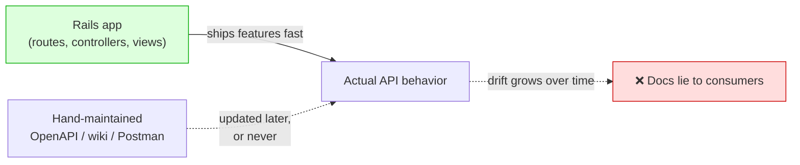
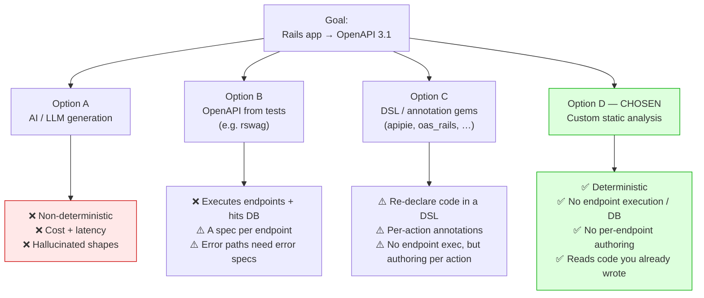
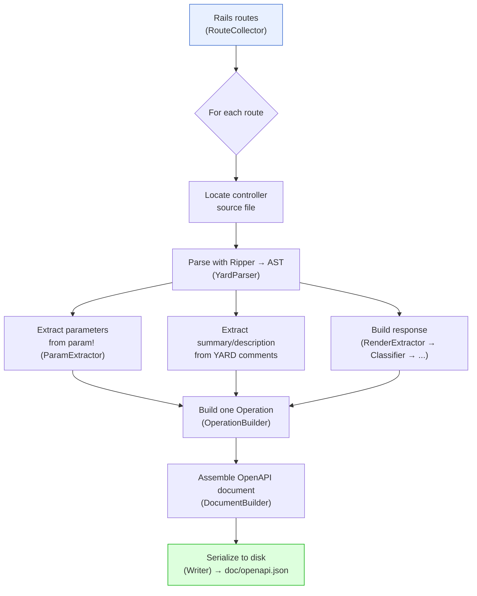
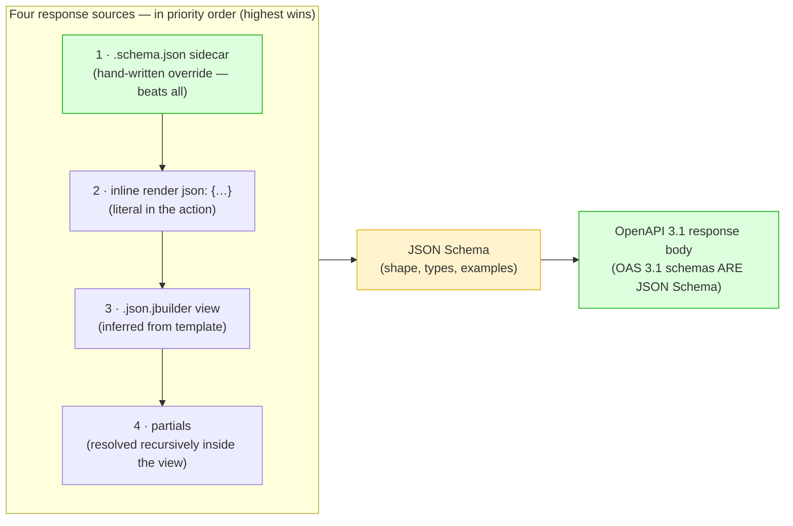

# rails-openapi-generator — Approach & Design

> Generate an OpenAPI 3.1 document for a Rails app by **static source analysis**. No controller code is executed.

This document walks through *why* the gem exists, *what alternatives* we considered, *how* it works at a high level, and a *deep dive* into a few of the more interesting design decisions.

📖 Full documentation lives on GitBook: **[English](https://tonystrawberry.gitbook.io/rails-openapi-generator)** · **[日本語](https://tonystrawberry.gitbook.io/rails-openapi-generator-ja)**. Relevant pages are linked inline throughout and collected under [Further reading](#further-reading).

---

## 1. Context — the problem

API documentation has one fundamental problem: **it drifts from the code**.

A Rails app is the source of truth for how the API actually behaves — its routes, its parameters, its response shapes. But the OpenAPI document that describes that API usually lives *somewhere else*: a hand-written YAML file, annotations in request specs, a Postman collection, a wiki page. Every one of those is a second copy of the truth, and second copies rot.



### Current state / pain points

- **Manual docs go stale.** Every new endpoint or field is a manual edit somewhere else. Reviewers rarely catch a missing doc update.
- **Consumers lose trust.** Once the spec is wrong once, frontend/mobile/partner teams stop believing it and go read the source themselves — which defeats the purpose.
- **Old endpoints had no documentation at all.** Drift assumes docs existed in the first place. In practice, large swaths of the existing API were never documented — endpoints built before any doc discipline, or under deadline pressure, simply have *nothing*. Retro-documenting hundreds of legacy endpoints by hand is a project nobody ever gets budget for, so the gap just persists.
- **The truth already exists in the code.** Rails developers already write `param!` validations, `.json.jbuilder` views, `render json:`, `rescue_from` handlers. That is a *literal, machine-readable* description of the API — it's just not in OpenAPI form.

> **The core insight:** the Rails source *is* the spec. We just need to translate it, deterministically, on every run — instead of asking humans to keep a parallel copy in sync.

Because the translation runs over the **entire route table automatically**, it also solves the legacy problem for free: every previously-undocumented endpoint gets back-filled in a single pass, with **zero per-endpoint manual effort**. The undocumented backlog stops being a budget line item.

It also creates a **virtuous cycle**. Once the generated spec is the artifact everyone consumes, the way to improve the docs is to improve the *code* — write the `param!` validation, add the YARD summary, keep the `.json.jbuilder` view honest, use literal values where you can. Documentation quality becomes a direct function of code quality, so the incentive nudges developers to write clearer, better-structured controllers and responses instead of maintaining prose on the side.

---

## 2. Options considered

We evaluated four broad approaches before building this gem.



### Option A — AI / LLM generation

We tried this **before**, and it didn't hold up in practice:

- **Non-deterministic.** The same controller could produce different schemas run to run. That breaks the "commit the spec, diff it in PRs" workflow entirely.
- **Cost & latency.** Running a model over an entire codebase on every generate is slow and expensive for something that should be a fast, free CI step.
- **Hallucination.** An LLM will happily invent a `created_at` field that doesn't exist, or drop one that does. For a *specification*, "plausible" is worse than "empty" — it actively misleads consumers.

AI is great for fuzzy tasks. A spec is a **contract**; it needs to be exact and reproducible.

### Option B — OpenAPI from tests (rswag-style)

[rswag](https://github.com/rswag/rswag) asks you to write request specs annotated with the OpenAPI shape you want, runs them, and emits the document as a side effect.

- **Appeal:** the requests really run, so the documented shape is the *actual* shape — lying is hard.
- **Cost:** CI must boot the app, hit a database, sign in test users, and execute every documented endpoint. That's slow.
- **Maintenance:** you write specs *to get docs*. The annotations are an extra surface, separate from the code.
- **Coverage:** error paths (`404`, `422`, …) only appear if you write error-path specs. Nobody enjoys writing those.
- **Retrofit cost — the dealbreaker for us:** to document the *existing* API this way, we'd have to write (or rewrite) annotated request specs for **every controller we already have**. Given how many endpoints predate any test discipline, that's a massive, unrealistic effort just to produce docs — and it ties documenting an endpoint to first having a test for it. Our whole problem is the undocumented legacy backlog; an approach that requires per-endpoint specs to make a dent in it doesn't actually solve it.

**What you'd write (rswag):**

```ruby
# spec/requests/users_spec.rb
require "swagger_helper"

RSpec.describe "Users API", type: :request do
  path "/users/{id}" do
    get "Retrieves a user" do
      tags "Users"
      produces "application/json"
      parameter name: :id, in: :path, type: :integer, required: true

      response "200", "user found" do
        schema type: :object,
               properties: {
                 id:   { type: :integer },
                 name: { type: :string },
                 email: { type: :string }
               }
        run_test!   # actually boots the app and hits the endpoint
      end
    end
  end
end
```

That's an entire annotated spec — per endpoint, per status — on top of the controller that already exists.

### Option C — Existing DSL / annotation gems

A number of gems generate OpenAPI/Swagger from in-code annotations or a DSL you add to controllers, served through a mounted engine at runtime. The common ones:

- **[apipie-rails](https://github.com/Apipie/apipie-rails)** — a DSL you write above each action (`api :GET, "/users"`, `param :id, Integer`). Powerful, but you *re-declare* every param and response in the DSL, duplicating the `param!` validations and views you already have. Serves docs from a mounted engine at runtime; a `rake apipie:static` export loads the Rails environment to read the DSL. It does **not** execute your actions or hit the DB.
- **[oas_rails](https://github.com/a-chacon/oas_rails)** — generates OpenAPI from special comment tags (`# @summary`, `# @parameter`) above actions. Newer and lighter, but still an annotation surface you maintain per action. Mounts an engine that builds the doc at runtime from routes + your tags; needs the app running to serve it, but does **not** execute actions or need a DB.
- **[swagger-blocks](https://github.com/swagger-api/swagger-blocks)** / **[swagger_yard](https://github.com/livingsocial/swagger_yard-rails)** — you hand-write the schema as Ruby DSL blocks or YARD-style tags. Essentially writing OpenAPI by hand in Ruby. The JSON is produced by loading those classes/comments (Rails env loaded), not by executing endpoints.

The shared problem: they all ask you to **re-declare, in a DSL or annotations, information the controller code already contains** — so they don't help the undocumented-legacy backlog any more than writing OpenAPI by hand would (you still touch every action). None of them execute your endpoints or need a DB (that's rswag's downside, not theirs) — but all of them require the Rails environment loaded to collect the annotations, and several are less actively maintained.

**What you'd write** — the same "show a user" endpoint in each:

*apipie-rails:*

```ruby
class UsersController < ApplicationController
  api :GET, "/users/:id", "Show a user"
  param :id, :number, required: true, desc: "User ID"
  returns code: 200, desc: "The user" do
    property :id,    Integer
    property :name,  String
    property :email, String
  end
  def show
    render json: @user
  end
end
```

*oas_rails (comment tags):*

```ruby
class UsersController < ApplicationController
  # @summary Show a user
  # @parameter id(path) [Integer] The user ID
  # @response User found(200) [Hash{id: Integer, name: String, email: String}]
  def show
    render json: @user
  end
end
```

*swagger-blocks:*

```ruby
class UsersController < ApplicationController
  include Swagger::Blocks

  swagger_path "/users/{id}" do
    operation :get do
      key :summary, "Show a user"
      parameter do
        key :name, :id
        key :in, :path
        key :required, true
        key :type, :integer
      end
      response 200 do
        key :description, "user found"
        schema do
          property(:id)    { key :type, :integer }
          property(:name)  { key :type, :string }
          property(:email) { key :type, :string }
        end
      end
    end
  end
  def show; render json: @user; end
end
```

**By contrast — this gem needs *none* of the above.** You just write the ordinary Rails controller and view; the spec is inferred from what's already there:

```ruby
# app/controllers/users_controller.rb
# Show a user
def show
  render json: @user   # or a users/show.json.jbuilder view
end
```

### Option D — Custom static analysis (this gem)

We took the opposite tradeoff from rswag: **never execute the controller — read the code.**

| Criterion | AI | Tests (rswag) | DSL/annotation gems | **Static (this gem)** |
|---|---|---|---|---|
| Deterministic / byte-identical output | ❌ | ⚠️ | ✅ | ✅ |
| Avoids executing endpoints / needing a DB | ✅ | ❌ | ✅ | ✅ |
| No per-endpoint authoring required | ✅ | ❌ | ❌ | ✅ |
| Uses code you already wrote | ✅ | ❌ | ❌ | ✅ |
| Documents error paths automatically | ❌ | ❌ | ❌ | ✅ |
| Cost / latency in CI | High | High | Low | Low |
| Accuracy (no invented fields) | ❌ | ✅ | ✅ | ✅ |
| No custom tool to maintain in-house | ✅ | ✅ | ✅ | ⚠️ (we own it) |

> **On "booting Rails":** rswag, the DSL/annotation gems, *and this gem* all load the Rails environment. The difference is what they do next. Only **rswag executes your endpoints and needs a database**. The DSL/annotation gems load Rails to collect the annotations you wrote. This gem loads Rails only to read the **route table**, then does pure static source analysis — no controller execution, no DB, no per-endpoint authoring.

The cost we accept: we can only see what is **literally written** in source. If an action does `render json: User.first.serializable_hash`, we know it returns JSON but cannot know the shape — so that part collapses to "any" (`{}`). We're honest about this, and we provide an override hatch (JSON Schema sidecars) for the cases where inference can't reach.

**The other cost — maintenance.** This is a **custom solution**, so we own it. Every Rails/jbuilder convention we want to understand is a code path *we* wrote and *we* maintain (the response cluster alone is ~1,000 lines across six files). A genuinely novel controller pattern — a new rendering style, a new DSL, a Ruby syntax the AST handling hasn't seen — may require a new feature in the gem before it's documented correctly. That's a real, ongoing engineering cost that the off-the-shelf options don't carry.

The mitigating factor: **as long as we keep implementing controllers the way we do today** — `param!` for inputs, `.json.jbuilder` / literal `render json:` for outputs, `rescue_from` for errors — **no additional changes to the gem are required.** New endpoints written in the established style are picked up for free. The maintenance cost is paid only when the *team's own conventions* change or a genuinely new pattern appears — and even then, the "warn, never raise" design means an unsupported pattern degrades to a permissive schema (or a sidecar override) rather than breaking the build.

#### How it was built — AI-driven, human-supervised

The gem itself was **developed almost entirely by AI, under my supervision** — my role was **QA**: defining what each feature should do, reviewing the output, and validating behavior against real controllers.

This was a deliberate choice enabled by the nature of the project:

- **It's an independent library.** It has **no regression impact on the main application** — worst case, a generated spec is imperfect; the app keeps running exactly as before. That removes the usual risk of letting AI move fast.
- **Input/output is easily testable.** The gem is a pure function: Rails source in → OpenAPI document out. That makes it trivial to pin behavior with fixture-based tests and assert on exact output — the ideal shape for a "let AI build it, human verifies" loop.

Given those two properties, I opted for a **"freedom" approach** — letting AI drive the implementation quickly — rather than the slower, hands-on-every-line style I'd use for code that lives in the critical path of the main app.

**Tests are the safety net.** Every behavior is covered by fixture-based tests (a dummy Rails app + expected OpenAPI output), so subsequent AI-driven improvements can't silently break existing behavior — a regression shows up as a failing assertion, not a surprise in production.

---

## 3. How the gem works — high level

The gem is a pipeline: **one route in → one OpenAPI operation out**, orchestrated by a single `Generator`. Every other class does exactly one job.



### The two parsers

Everything rests on reading Ruby source without running it. We use two standard-library-friendly parsers:

- **[Ripper](https://docs.ruby-lang.org/en/master/Ripper.html)** — ships with Ruby, turns source into an S-expression AST. Frozen against Ruby's grammar, so new syntax "just works" on the same release. No extra dependency.
- **[YARD](https://yardoc.org/)** — used for exactly one thing: pulling the comment block above each `def` into `summary` / `description`.

We deliberately avoided the friendlier `parser` gem to keep the dependency surface tiny (only `railties` + `yard` at runtime).

### Where the data comes from

| OpenAPI piece | Rails source it's derived from |
|---|---|
| Paths & HTTP methods | The Rails route table |
| `summary` / `description` | YARD comments above the action |
| Parameters & request body | `param!` calls (incl. nested `Hash` blocks) |
| Response body | In priority order: a `.schema.json` sidecar (override) › inline `render json:` › `.json.jbuilder` view › partials (resolved inside the view) |
| Status codes | `head`, `render status:`, `redirect_to`, or HTTP-method convention |
| Error responses | `rescue_from` handlers on the controller chain |

*GitBook: [Summaries & Descriptions](https://tonystrawberry.gitbook.io/rails-openapi-generator/features/yard-comments) · [Parameters](https://tonystrawberry.gitbook.io/rails-openapi-generator/features/parameters) · [Response Bodies](https://tonystrawberry.gitbook.io/rails-openapi-generator/features/response-bodies) · [Status Codes](https://tonystrawberry.gitbook.io/rails-openapi-generator/features/status-codes) · [Error Responses](https://tonystrawberry.gitbook.io/rails-openapi-generator/features/error-responses) · [HTML & File Responses](https://tonystrawberry.gitbook.io/rails-openapi-generator/features/html-and-file-responses)*

### The design rules that hold it together

- **Warn, never raise.** Anything we can't understand degrades gracefully (a warning + a permissive schema), never a crash. One broken controller still yields a full document for the other 99.
- **Deterministic output.** Same source → byte-identical document. This is what makes "commit the spec and diff it in PRs" work.
- **Simplicity / YAGNI.** No autoloader, no DI container — 30 small single-purpose files wired together explicitly in one `Generator`.

---

## 4. Deep dive with examples

### 4.1 End-to-end: one controller action → OpenAPI operation

Here's a complete action and its view, followed by the **real output at every stage** (the intermediate dumps below were produced by running the gem's own components — `YardParser`, `ParamExtractor`, `SchemaMapper`, `JbuilderParser` — on this exact input).

**The input** — a controller and a jbuilder view:

```ruby
# app/controllers/api/articles_controller.rb
class Api::ArticlesController < ApplicationController
  # Search articles
  # Returns published articles matching the given filters, newest first.
  def index
    param! :q,        String,  blank: false, description: "Free-text search"
    param! :per_page, Integer, in: 1..100, required: false, description: "Page size"
  end
end
```

```ruby
# app/views/api/articles/index.json.jbuilder
json.array! @articles do |article|
  json.id article.id
  json.title article.title
  json.status "published"
  json.author do
    json.name article.author_name
  end
end
```

**Stage 1 — Ripper turns a `param!` line into an AST** (`param! :per_page, Integer, in: 1..100, required: false`):

```ruby
[:program,
 [[:command,
   [:@ident, "param!", [1, 0]],
   [:args_add_block,
    [[:symbol_literal, [:symbol, [:@ident, "per_page", [1, 8]]]],   # name → :per_page
     [:var_ref, [:@const, "Integer", [1, 18]]],                     # type → Integer
     [:bare_assoc_hash,                                             # options
      [[:assoc_new,
        [:@label, "in:", [1, 27]],
        [:dot2, [:@int, "1", [1, 31]], [:@int, "100", [1, 34]]]],   # in: 1..100  (:dot2 = range)
       [:assoc_new,
        [:@label, "required:", [1, 39]],
        [:var_ref, [:@kw, "false", [1, 49]]]]]]],
    false]]]]
```

**Stage 2 — YARD gives the raw docstring, the gem splits it.** YARD's only job is to hand back the plain comment text above the method (`object.docstring.to_s` → `"Search articles\nReturns published articles matching…"`). The gem's `DocCommentExtractor` then splits that string into a summary (first line) and description (the rest), producing its **own** `DocComment` struct (not a YARD type):

```ruby
#<DocComment
  summary="Search articles",
  description="Returns published articles matching the given filters, newest first.">
```

**Stage 3 — `ParamExtractor` resolves each `param!` into a `ParamCall`.** It works on the **same Ripper AST** from `YardParser` (no re-parsing). For each `param!` command node it reads the leading symbol as the name, the trailing `@const` as the type, and hands the `:bare_assoc_hash` (the `key: value` options) to `LiteralEvaluator`, which turns literals into real Ruby values (`1..100` → a `Range`, `false` → `false`, the string → a `String`). Below, each raw Ripper AST (input) is shown directly above the `ParamCall` it produces (output):

```ruby
# ── param! :q, String, blank: false, description: "Free-text search" ──
# Ripper AST (input to ParamExtractor):
[:command,
 [:@ident, "param!", [1, 0]],
 [:args_add_block,
  [[:symbol_literal, [:symbol, [:@ident, "q", [1, 8]]]],       # name → "q"
   [:var_ref, [:@const, "String", [1, 11]]],                   # type → "String"
   [:bare_assoc_hash,                                          # options → LiteralEvaluator
    [[:assoc_new, [:@label, "blank:", [1, 19]], [:var_ref, [:@kw, "false", [1, 26]]]],
     [:assoc_new, [:@label, "description:", [1, 33]],
      [:string_literal, [:string_content, [:@tstring_content, "Free-text search", [1, 47]]]]]]]],
  false]]
# ↓ ParamExtractor + LiteralEvaluator →
#<ParamCall name="q", type="String", required=false,
  constraints={:blank=>false, :description=>"Free-text search"}, fully_resolved=true, nested=nil>


# ── param! :per_page, Integer, in: 1..100, required: false, description: "Page size" ──
# Ripper AST (input to ParamExtractor):
[:command,
 [:@ident, "param!", [1, 0]],
 [:args_add_block,
  [[:symbol_literal, [:symbol, [:@ident, "per_page", [1, 8]]]],   # name → "per_page"
   [:var_ref, [:@const, "Integer", [1, 18]]],                     # type → "Integer"
   [:bare_assoc_hash,                                            # options → LiteralEvaluator
    [[:assoc_new, [:@label, "in:", [1, 27]],
      [:dot2, [:@int, "1", [1, 31]], [:@int, "100", [1, 34]]]],   # :dot2 range → 1..100
     [:assoc_new, [:@label, "required:", [1, 39]], [:var_ref, [:@kw, "false", [1, 49]]]],
     [:assoc_new, [:@label, "description:", [1, 56]],
      [:string_literal, [:string_content, [:@tstring_content, "Page size", [1, 70]]]]]]]],
  false]]
# ↓ ParamExtractor + LiteralEvaluator →
#<ParamCall name="per_page", type="Integer", required=false,
  constraints={:in=>1..100, :description=>"Page size"}, fully_resolved=true, nested=nil>
```

Note `in: 1..100` became a real Ruby `Range`, and `fully_resolved=true` means nothing in the call was left as `UNRESOLVED` (the marker `LiteralEvaluator` returns for anything that isn't a literal; the gem degrades gracefully on it instead of raising). Had an option been, say, `in: SomeModel.scope`, that option would be dropped and `fully_resolved` would flip to `false`, surfacing as a warning. Constant references are the one exception to "literals only": `in: Order::STATUSES` is looked up and becomes `enum: ["paid", "shipped", …]`, but `Order::STATUSES.sort` stays unresolved, because the gem resolves names and never runs code.

**Stage 4 — `SchemaMapper` turns each `ParamCall` into a schema** (`blank: false` → `minLength: 1`; the `1..100` range → `minimum`/`maximum`):

```ruby
q        → {"type"=>"string",  "minLength"=>1, "description"=>"Free-text search"}
per_page → {"type"=>"integer", "minimum"=>1, "maximum"=>100, "description"=>"Page size"}
```

**Stage 5 — `JbuilderParser` walks the view's AST into a response schema.** Like the others it uses **Ripper** (`Ripper.sexp(File.read(view))`) — it never executes the template. It walks the `json.*` calls: `json.array!` with a block → an array whose `items` come from the block body; each `json.<key> <value>` → a property named `<key>` whose schema comes from the value (a literal like `"published"` → typed + `example`; a runtime expression like `article.id` → the permissive `{}`); a `json.<key> do … end` → a nested object. Below is the raw Ripper AST (input) followed by the schema it produces (output):

```ruby
# ── the view's Ripper AST (input to JbuilderParser) ──
[:method_add_block,
 [:command_call,                                             # json.array! @articles
  [:vcall, [:@ident, "json", [1, 0]]], [:@period, ".", [1, 4]],
  [:@ident, "array!", [1, 5]],                               # array! → { type: array }
  [:args_add_block, [[:var_ref, [:@ivar, "@articles", [1, 12]]]], false]],
 [:do_block,
  [:block_var, [:params, [[:@ident, "article", [1, 26]]], ...], false],
  [:bodystmt,
   [[:command_call,                                          # json.id article.id
     [:vcall, [:@ident, "json", [2, 2]]], [:@period, ".", [2, 6]],
     [:@ident, "id", [2, 7]],                                # key "id"
     [:args_add_block,
      [[:call, [:var_ref, [:@ident, "article", ...]], [:@period, "."], [:@ident, "id", ...]]],  # value = runtime → {}
      false]],
    [:command_call,                                          # json.title article.title
     [:vcall, [:@ident, "json", [3, 2]]], [:@period, "."], [:@ident, "title", [3, 7]],
     [:args_add_block, [[:call, ...article.title... ]], false]],   # value = runtime → {}
    [:command_call,                                          # json.status "published"
     [:vcall, [:@ident, "json", [4, 2]]], [:@period, "."], [:@ident, "status", [4, 7]],
     [:args_add_block,
      [[:string_literal, [:string_content, [:@tstring_content, "published", [4, 15]]]]],  # literal → typed + example
      false]],
    [:method_add_block,                                      # json.author do ... end
     [:call, [:vcall, [:@ident, "json", [5, 2]]], [:@period, "."], [:@ident, "author", [5, 7]]],
     [:do_block, nil,
      [:bodystmt,
       [[:command_call,                                      # json.name article.author_name
         [:vcall, [:@ident, "json", [6, 4]]], [:@period, "."], [:@ident, "name", [6, 9]],
         [:args_add_block, [[:call, ...article.author_name... ]], false]]],  # value = runtime → {}
       ...]]]],
   ...]]]
# ↓ JbuilderParser →
{
  "type": "array",
  "items": {
    "type": "object",
    "properties": {
      "author": { "type": "object", "properties": { "name": {} } },
      "id": {},
      "status": { "type": "string", "example": "published" },
      "title": {}
    }
  }
}
```

(The AST above is lightly trimmed — `...` marks omitted positional/`nil` slots — but every `json.*` call and its value node is shown as Ripper emits it.)

Conditionals in a view are merged rather than picked: if a template does `json.admin_only true` in an `if` branch and `json.member_only true` in the `else`, the schema contains both properties. The same applies to `elsif`, `unless`, and `case`/`when`.

**Stage 6 — `OperationBuilder` builds one `Endpoint` (per route).** This stage handles a single operation. It combines the outputs of the previous stages into the gem's own internal `Endpoint` struct. That struct is not OpenAPI JSON yet. Along the way it decides where each parameter goes (path, query, or request body; for a `GET`, it's query). It also moves each parameter's `description` out of its schema and onto the parameter itself, appends a source reference to the description, and computes the `operationId` and the controller tag.

```ruby
# ── Input ──
route           = Route(GET "/api/articles" → api/articles#index)
doc_comment     = DocComment(summary: "Search articles", description: "Returns published articles…")  # Stage 2
param_calls     = [ParamCall(q …), ParamCall(per_page …)]                                              # Stage 3
response        = Response(200, body: <jbuilder schema>)                                               # Stage 5
source_location = "app/controllers/api/articles_controller.rb:4"

# ↓ OperationBuilder#build →

# ── Output ──
#<struct Endpoint
 http_method="GET",
 path="/api/articles",
 summary="Search articles",
 description="Returns published articles matching the given filters, newest first.\n\n" +
             "_Source: `app/controllers/api/articles_controller.rb:4`_",
 parameters=
  [#<struct Parameter name="q", location=:query, required=false,
     schema={"type"=>"string", "minLength"=>1},                       # description moved out of schema…
     description="Free-text search">,                                 # …onto the parameter
   #<struct Parameter name="per_page", location=:query, required=false,
     schema={"type"=>"integer", "minimum"=>1, "maximum"=>100},
     description="Page size">],
 request_body=nil,                                                    # GET → no body
 operation_id="get_api_articles",
 tag="Api::ArticlesController",
 response=
  #<struct Response kind=:json, description="Successful response",
    entries=[#<struct ResponseEntry status=200, body={"type"=>"array", "items"=>{…}}, content_types=nil>]>>
```

**Stage 7 — `DocumentBuilder` assembles every `Endpoint` into the OpenAPI document (whole app).** This stage runs once, over all endpoints. It adds the top-level `openapi`, `info`, and `tags` sections, groups endpoints by path and then by HTTP method, and sorts everything so the output is deterministic (parameters, for example, are sorted by name). It turns each `Endpoint` into an OpenAPI operation object, including the `responses` map with its content type, and rewrites Rails path segments into OpenAPI form (`:id` → `{id}`).

```ruby
# ── Input ──
endpoints = [Endpoint(GET /api/articles), …]   # one per route, from Stage 6
configuration.title = "My API"                 # api_version defaults to "1.0.0"

# ↓ DocumentBuilder#build →
```

```json
{
  "openapi": "3.1.0",
  "info": { "title": "My API", "version": "1.0.0" },
  "tags": [{ "name": "Api::ArticlesController" }],
  "paths": {
    "/api/articles": {
      "get": {
        "operationId": "get_api_articles",
        "tags": ["Api::ArticlesController"],
        "summary": "Search articles",
        "description": "Returns published articles matching the given filters, newest first.\n\n_Source: `app/controllers/api/articles_controller.rb:4`_",
        "parameters": [
          {
            "name": "per_page",
            "in": "query",
            "required": false,
            "description": "Page size",
            "schema": { "type": "integer", "minimum": 1, "maximum": 100 }
          },
          {
            "name": "q",
            "in": "query",
            "required": false,
            "description": "Free-text search",
            "schema": { "type": "string", "minLength": 1 }
          }
        ],
        "responses": {
          "200": {
            "description": "Successful response",
            "content": {
              "application/json": {
                "schema": {
                  "type": "array",
                  "items": {
                    "type": "object",
                    "properties": {
                      "author": { "type": "object", "properties": { "name": {} } },
                      "id": {},
                      "status": { "type": "string", "example": "published" },
                      "title": {}
                    }
                  }
                }
              }
            }
          }
        }
      }
    }
  }
}
```

Every field in that final document traces back to something literally present in the controller or the view — no execution, no guessing. And had inference not been enough, an `articles/index.schema.json` sidecar would have replaced the `200` body verbatim (§4.4).

### 4.2 Why JSON Schema for documenting response bodies

This is the most interesting response-side decision. A Rails action can return a body through **at least four** mechanisms, and every one of them ultimately needs to be expressed as a **schema of a shape**, not a concrete value:



**Precedence (highest wins):** a `.schema.json` **sidecar** overrides everything (it's applied last and even un-marks an "undeterminable" response). Absent a sidecar, an **inline `render json:`** literal at the convention status beats the view (the explicit call is the more specific signal). Otherwise the **`.json.jbuilder` view** is used. **Partials** aren't a competing top-level source — they're resolved *within* jbuilder view parsing, so they contribute wherever a view or another partial references them.

**Why JSON Schema specifically?**

1. **OpenAPI 3.1 schemas *are* JSON Schema (draft 2020-12).** This is the killer reason: in 3.1 the schema object is a fully compliant JSON Schema dialect. So if we produce JSON Schema, it drops directly into the `responses` section with **no translation layer** — the thing we infer and the thing OpenAPI wants are the same thing.
2. **It expresses "shape without data."** Since we never execute code, we can't produce a real response body. But a jbuilder template *tells us the shape*: `json.role "member"` → `{ type: string, example: "member" }`. JSON Schema is exactly the vocabulary for "a string here, an array of these there, this field is required."
3. **It's the natural override format.** When inference can't reach (e.g. `render json: some_service.call`), the user drops a `.schema.json` file next to the view. Because our inferred output *is already JSON Schema*, the override and the inference are interchangeable — one replaces the other verbatim, no adapter needed.

#### Example: jbuilder → JSON Schema

Given this view:

```ruby
# app/views/api/users/_user.json.jbuilder
json.extract! user, :id, :name, :email
json.role "member"
json.profile do
  json.bio user.bio
end
```

We walk the AST (not the data) and emit:

```json
{
  "type": "object",
  "properties": {
    "id":    {},
    "name":  {},
    "email": {},
    "role":    { "type": "string", "example": "member" },
    "profile": {
      "type": "object",
      "properties": { "bio": {} }
    }
  }
}
```

Notice the tradeoff made explicit: `json.role "member"` is a **literal**, so we recover its type *and* an example. `json.extract! user, :id` and `json.bio user.bio` depend on runtime data, so they become `{}` ("any") — honest about what static analysis can and cannot know.

*GitBook: [Response Bodies](https://tonystrawberry.gitbook.io/rails-openapi-generator/features/response-bodies).*

### 4.3 Following the code: error responses from helpers, callbacks, and `rescue_from`

A `render` is often not in the action body. It hides behind a helper, a `before_action`, or a `rescue_from`. We statically chase these across the controller's ancestor chain (concerns included), up to a configurable depth, and even bind literal call-site arguments to the helper's parameters:

```ruby
rescue_from Pundit::NotAuthorizedError, with: :render_forbidden

def render_forbidden
  render_error(status: :forbidden, code: "FORBIDDEN", message: "...")
end

def render_error(status:, code:, message:)
  render json: { error: { code: code, message: message } }, status: status
end
```

→ every operation in the controller gains a **`403`** response with the correct body schema — recovered two calls deep, with the literal `code`/`message` bound through the arguments. This is how error responses get documented *automatically*, without writing error-path specs.

*GitBook: [Error Responses](https://tonystrawberry.gitbook.io/rails-openapi-generator/features/error-responses).*

### 4.4 The escape hatch: JSON Schema sidecars

Inference fails sometimes — and that's fine. Drop a `.schema.json` next to the template or the action's view path and it's loaded **verbatim**, replacing inference:

```text
app/views/api/users/_user.schema.json   # used wherever the partial resolves
app/views/api/users/show.schema.json    # the action's response schema
app/views/api/users/create.schema.json  # works even with no view (inline render)
```

A malformed sidecar emits a warning and falls back to inference — never raises. This gives users a precise manual override exactly where automation can't reach, using the *same JSON Schema format* the gem already speaks.

*GitBook: [JSON Schema Sidecars](https://tonystrawberry.gitbook.io/rails-openapi-generator/guides/schema-sidecars).*


---

## Summary

- **Problem:** API docs drift from code because they're a second copy of the truth — and many legacy endpoints were never documented at all.
- **Insight:** the Rails source already *is* the spec — translate it deterministically instead of maintaining a parallel copy. Running over the whole route table back-fills every undocumented endpoint in one pass, with zero per-endpoint effort.
- **Virtuous cycle:** making the source the source of truth means better docs = better code. Developers are nudged to write clear `param!`, YARD comments, and honest response views, because that's now the way to improve the spec.
- **Rejected:** AI (non-deterministic, costly, hallucinates), test-based/rswag (executes endpoints + DB, a spec per endpoint), DSL/annotation gems (re-declare per endpoint what the code already contains).
- **Chosen:** static analysis with Ripper + YARD — deterministic, byte-identical, no controller execution / DB, no per-endpoint authoring, reads code you already wrote.
- **Key design choice:** express every response body as **JSON Schema**, because OpenAPI 3.1 response schemas *are* JSON Schema — inference output and hand-written overrides become interchangeable.
- **Safety net:** warn-never-raise + a JSON Schema sidecar override for whatever inference can't reach.

---

## Further reading

Full documentation on GitBook — **[English](https://tonystrawberry.gitbook.io/rails-openapi-generator)** · **[日本語](https://tonystrawberry.gitbook.io/rails-openapi-generator-ja)**.

**Getting started**
- [Installation](https://tonystrawberry.gitbook.io/rails-openapi-generator/getting-started/installation)
- [Quick Start](https://tonystrawberry.gitbook.io/rails-openapi-generator/getting-started/quick-start)
- [Configuration](https://tonystrawberry.gitbook.io/rails-openapi-generator/getting-started/configuration)

**Features**
- [Summaries & Descriptions (YARD)](https://tonystrawberry.gitbook.io/rails-openapi-generator/features/yard-comments)
- [Parameters](https://tonystrawberry.gitbook.io/rails-openapi-generator/features/parameters)
- [Response Bodies](https://tonystrawberry.gitbook.io/rails-openapi-generator/features/response-bodies)
- [Status Codes](https://tonystrawberry.gitbook.io/rails-openapi-generator/features/status-codes)
- [Error Responses](https://tonystrawberry.gitbook.io/rails-openapi-generator/features/error-responses)
- [HTML Pages & File Downloads](https://tonystrawberry.gitbook.io/rails-openapi-generator/features/html-and-file-responses)

**Guides**
- [JSON Schema Sidecars](https://tonystrawberry.gitbook.io/rails-openapi-generator/guides/schema-sidecars)
- [Route Filtering](https://tonystrawberry.gitbook.io/rails-openapi-generator/guides/route-filtering)
- [Previewing the Spec](https://tonystrawberry.gitbook.io/rails-openapi-generator/guides/previewing-docs)
- [Programmatic Use](https://tonystrawberry.gitbook.io/rails-openapi-generator/guides/programmatic-use)

**Reference & examples**
- [Configuration Options](https://tonystrawberry.gitbook.io/rails-openapi-generator/reference/configuration)
- [Basic CRUD API](https://tonystrawberry.gitbook.io/rails-openapi-generator/examples/basic-crud-api)
- [Nested Parameters](https://tonystrawberry.gitbook.io/rails-openapi-generator/examples/nested-params)

> Note: GitBook URL slugs may differ slightly from the paths above if the space uses custom slugs. If a deep link 404s, start from the [documentation home](https://tonystrawberry.gitbook.io/rails-openapi-generator) and navigate via the sidebar (the structure mirrors this list).
