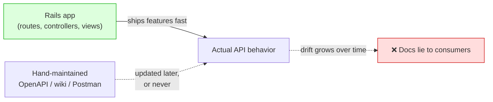
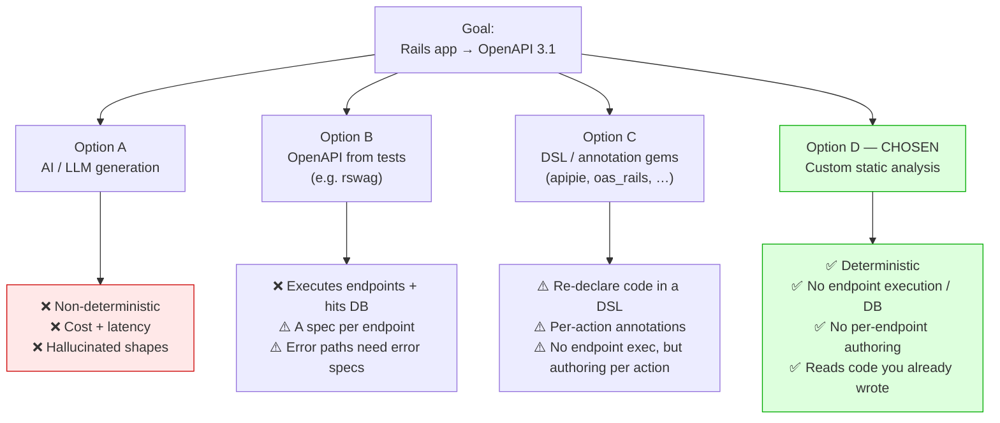
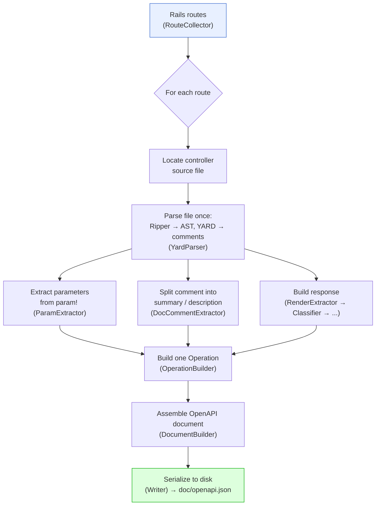
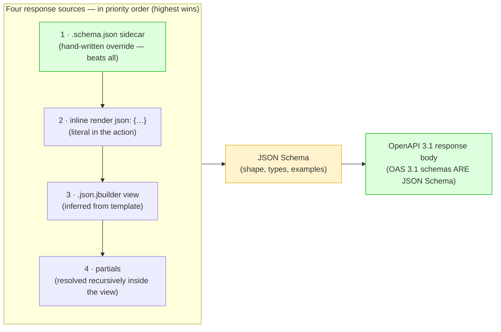
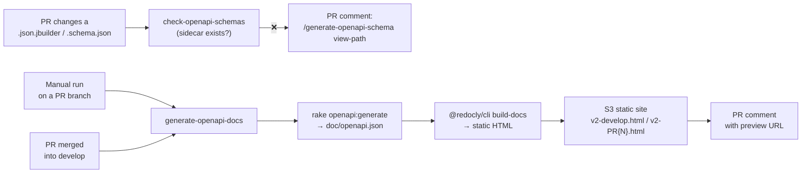

# rails-openapi-generator — Approach & Design

> Generate an OpenAPI 3.1 document for a Rails app by **static source analysis**. No controller code is executed.

- **Agenda (30 min):** Context (4) · Options considered (8) · How it works (5) · Deep dive (9) · CI & deployment (3) · Summary (1)
- 📖 Docs on GitBook: **[English](https://tonystrawberry.gitbook.io/rails-openapi-generator)** · **[日本語](https://tonystrawberry.gitbook.io/rails-openapi-generator-ja)**

---

## 1. Context — the problem
**API docs drift from the code.**

- The Rails app is the real source of truth: routes, params, response shapes
- The docs live somewhere else: hand-written YAML, Postman, wiki
- Every second copy of the truth goes stale



### Pain points

- **Manual docs go stale:** every new field is an extra edit, and reviewers rarely catch a missing one
- **Consumers lose trust:** once the spec is wrong, frontend/mobile teams read the source instead
- **Old endpoints have no docs at all:** retro-documenting hundreds of them by hand never gets budget
- **The truth already exists in code:** `param!`, `.json.jbuilder`, `render json:`, `rescue_from`. It's just not in OpenAPI form.

### The insight

> **The Rails source *is* the spec.** Translate it on every run instead of keeping a parallel copy in sync.

- **Legacy backlog solved for free:** one run documents every route, with no per-endpoint effort
- **Virtuous cycle:** to improve the docs, you improve the code (`param!`, YARD comments, honest views)

---

## 2. Options considered


### Option A — AI / LLM generation (tried before)

- **Non-deterministic:** the same controller gives different schemas run to run, so specs can't be diffed in PRs
- **Cost & latency:** running a model over the whole codebase on every generate is slow and expensive
- **Hallucination:** invents fields that don't exist, or drops real ones
- A spec is a **contract**: it must be exact and reproducible

### Option B — OpenAPI from tests ([rswag](https://github.com/rswag/rswag))

- ✅ Requests really run, so the documented shape is the actual shape
- ❌ CI must boot the app, hit a DB, sign in users, and run every endpoint
- ❌ You write specs *to get docs*: an extra surface to maintain
- ❌ Error paths (`404`, `422`) only show up if you write error specs
- ❌ **Dealbreaker:** we'd have to write specs for **every existing controller**, which isn't realistic

```ruby
# spec/requests/users_spec.rb
RSpec.describe "Users API", type: :request do
  path "/users/{id}" do
    get "Retrieves a user" do
      produces "application/json"
      parameter name: :id, in: :path, type: :integer, required: true

      response "200", "user found" do
        schema type: :object,
               properties: { id: { type: :integer }, name: { type: :string }, email: { type: :string } }
        run_test!   # actually boots the app and hits the endpoint
      end
    end
  end
end
```

### Option C — DSL / annotation gems

- **[apipie-rails](https://github.com/Apipie/apipie-rails):** a DSL above each action (`api`, `param`, `returns`)
- **[oas_rails](https://github.com/a-chacon/oas_rails):** comment tags (`# @summary`, `# @parameter`), served by a mounted engine
- **[swagger-blocks](https://github.com/swagger-api/swagger-blocks) / [swagger_yard](https://github.com/livingsocial/swagger_yard-rails):** hand-written schema as Ruby DSL blocks or YARD tags
- ✅ None of them execute endpoints or need a DB
- ❌ All of them make you **re-declare what the controller already says**, action by action
- ❌ So they don't help with the legacy backlog: you still touch every action

The same "show a user" endpoint in each:

```ruby
# apipie-rails
api :GET, "/users/:id", "Show a user"
param :id, :number, required: true, desc: "User ID"
returns code: 200, desc: "The user" do
  property :id,    Integer
  property :name,  String
  property :email, String
end
def show
  render json: @user
end
```

```ruby
# oas_rails
# @summary Show a user
# @parameter id(path) [Integer] The user ID
# @response User found(200) [Hash{id: Integer, name: String, email: String}]
def show
  render json: @user
end
```

```ruby
# swagger-blocks
swagger_path "/users/{id}" do
  operation :get do
    key :summary, "Show a user"
    parameter do
      key :name, :id
      key :in, :path
      key :required, true
      key :type, :integer
    end
    response 200 do
      key :description, "user found"
      schema do
        property(:id)    { key :type, :integer }
        property(:name)  { key :type, :string }
        property(:email) { key :type, :string }
      end
    end
  end
end
```

**This gem needs none of that.** Just the ordinary controller:

```ruby
# Show a user
def show
  render json: @user   # or a users/show.json.jbuilder view
end
```

### Option D — Custom static analysis (this gem) ✅

**Read the code, never execute it.**

| Criterion | AI | Tests (rswag) | DSL/annotation gems | **Static (this gem)** |
|---|---|---|---|---|
| Deterministic / byte-identical output | ❌ | ⚠️ | ✅ | ✅ |
| Avoids executing endpoints / needing a DB | ✅ | ❌ | ✅ | ✅ |
| No per-endpoint authoring required | ✅ | ❌ | ❌ | ✅ |
| Uses code you already wrote | ✅ | ❌ | ❌ | ✅ |
| Documents error paths automatically | ❌ | ❌ | ❌ | ✅ |
| Cost / latency in CI | High | High | Low | Low |
| Accuracy (no invented fields) | ❌ | ✅ | ✅ | ✅ |
| No custom tool to maintain in-house | ✅ | ✅ | ✅ | ⚠️ (we own it) |

- **About booting Rails:** all of these load the Rails environment
  - Only rswag executes endpoints and needs a DB
  - This gem loads Rails only to read the **route table**; the rest is static source analysis

**Costs we accept**

- **Only literal code is visible:** `render json: User.first.serializable_hash` becomes "any" (`{}`); sidecars cover the gaps
- **Maintenance:** it's a custom tool, so we own it (the response logic alone is ~1,000 lines)
  - A genuinely new controller pattern may need a gem change
  - **As long as we keep writing controllers the way we do today, no gem changes are needed**
  - Unsupported patterns degrade to a permissive schema; they don't break the build

**How it was built: AI-driven, human-supervised**

- The gem was **written almost entirely by AI**; my role was **QA** (define features, review, validate)
- A safe fit for a "freedom" approach because:
  - **Independent library:** no regression risk for the main app
  - **Easy to test:** Rails source in → OpenAPI document out
- **Tests are the safety net:** fixture-based tests (a dummy Rails app + expected output) catch regressions on each improvement

---

## 3. How the gem works — high level
**One route in → one OpenAPI operation out**, orchestrated by a single `Generator`.



### Two parsers

- **[Ripper](https://docs.ruby-lang.org/en/master/Ripper.html):** built into Ruby; turns source into a tree (AST); no extra dependency
- **[YARD](https://yardoc.org/):** used only to read the comment above each method

### Where the data comes from

| OpenAPI piece | Rails source |
|---|---|
| Paths & HTTP methods | The Rails route table |
| `summary` / `description` | YARD comments above the action |
| Parameters & request body | `param!` calls (incl. nested `Hash` blocks) |
| Response body | In priority order: `.schema.json` sidecar › inline `render json:` › `.json.jbuilder` view › partials |
| Status codes | `head`, `render status:`, `redirect_to`, or HTTP-method convention |
| Error responses | `rescue_from` handlers on the controller chain |

### Design rules

- **Warn, never raise:** one broken controller still leaves a full document for the other 99
- **Deterministic:** same source → byte-identical output, so the spec can be committed and diffed
- **Simple:** ~30 small single-purpose files, wired together explicitly in one `Generator`

---

## 4. Deep dive
### 4.1 End-to-end: one action → OpenAPI operation

- A real action and view, followed by the output of each stage
- The dumps come from running the gem's own classes on this exact input

**Input**

```ruby
# app/controllers/api/articles_controller.rb
class Api::ArticlesController < ApplicationController
  # Search articles
  # Returns published articles matching the given filters, newest first.
  def index
    param! :q,        String,  blank: false, description: "Free-text search"
    param! :per_page, Integer, in: 1..100, required: false, description: "Page size"
  end
end
```

```ruby
# app/views/api/articles/index.json.jbuilder
json.array! @articles do |article|
  json.id article.id
  json.title article.title
  json.status "published"
  json.author do
    json.name article.author_name
  end
end
```

**Stage 1 — YARD → `DocComment`**

- YARD returns only the raw comment text
- The gem's `DocCommentExtractor` splits it: first line = summary, the rest = description
- `DocComment` is the gem's own struct, not a YARD type

```ruby
# ── Input: YARD docstring (object.docstring.to_s) ──
"Search articles\nReturns published articles matching the given filters, newest first."

# ── Output: DocCommentExtractor ──
#<DocComment
  summary="Search articles",
  description="Returns published articles matching the given filters, newest first.">
```

**Stage 2 — `ParamExtractor`: Ripper AST → `ParamCall`**

- Reads the name (symbol), the type (constant) and the options hash from each `param!` node
- `LiteralEvaluator` turns literals into Ruby values (`1..100` → `Range`)
- Non-literals become `UNRESOLVED`: the option is dropped, `fully_resolved` turns `false`, and the run reports a warning
- Constants are resolved (`Order::STATUSES` → enum); expressions like `.sort` are not

```ruby
# ── Input: param! :q, String, blank: false, description: "Free-text search" ──
[:command,
 [:@ident, "param!", [1, 0]],
 [:args_add_block,
  [[:symbol_literal, [:symbol, [:@ident, "q", [1, 8]]]],       # name → "q"
   [:var_ref, [:@const, "String", [1, 11]]],                   # type → "String"
   [:bare_assoc_hash,                                          # options → LiteralEvaluator
    [[:assoc_new, [:@label, "blank:", [1, 19]], [:var_ref, [:@kw, "false", [1, 26]]]],
     [:assoc_new, [:@label, "description:", [1, 33]],
      [:string_literal, [:string_content, [:@tstring_content, "Free-text search", [1, 47]]]]]]]],
  false]]
# ── Output ──
#<ParamCall name="q", type="String", required=false,
  constraints={:blank=>false, :description=>"Free-text search"}, fully_resolved=true, nested=nil>


# ── Input: param! :per_page, Integer, in: 1..100, required: false, description: "Page size" ──
[:command,
 [:@ident, "param!", [1, 0]],
 [:args_add_block,
  [[:symbol_literal, [:symbol, [:@ident, "per_page", [1, 8]]]],   # name → "per_page"
   [:var_ref, [:@const, "Integer", [1, 18]]],                     # type → "Integer"
   [:bare_assoc_hash,                                            # options → LiteralEvaluator
    [[:assoc_new, [:@label, "in:", [1, 27]],
      [:dot2, [:@int, "1", [1, 31]], [:@int, "100", [1, 34]]]],   # :dot2 range → 1..100
     [:assoc_new, [:@label, "required:", [1, 39]], [:var_ref, [:@kw, "false", [1, 49]]]],
     [:assoc_new, [:@label, "description:", [1, 56]],
      [:string_literal, [:string_content, [:@tstring_content, "Page size", [1, 70]]]]]]]],
  false]]
# ── Output ──
#<ParamCall name="per_page", type="Integer", required=false,
  constraints={:in=>1..100, :description=>"Page size"}, fully_resolved=true, nested=nil>
```

- `[1, 15]`-style pairs are source positions: `[line, column]`

**Stage 3 — `SchemaMapper`: `ParamCall` → schema**

- `blank: false` → `minLength: 1`
- `in: 1..100` → `minimum` / `maximum`

```ruby
q        → {"type"=>"string",  "minLength"=>1, "description"=>"Free-text search"}
per_page → {"type"=>"integer", "minimum"=>1, "maximum"=>100, "description"=>"Page size"}
```

**Stage 4 — `JbuilderParser`: view AST → response schema**

- Parses the template with Ripper; never executes it
- `json.array!` + block → array
- `json.<key> <literal>` → typed property with an `example`
- `json.<key> <runtime value>` → `{}` (any)
- `json.<key> do … end` → nested object
- `if` / `else` / `case` branches are merged: properties from every branch appear

```ruby
# ── Input: the view's Ripper AST (trimmed; `...` = omitted slots) ──
[:method_add_block,
 [:command_call,                                             # json.array! @articles
  [:vcall, [:@ident, "json", [1, 0]]], [:@period, ".", [1, 4]],
  [:@ident, "array!", [1, 5]],                               # array! → { type: array }
  [:args_add_block, [[:var_ref, [:@ivar, "@articles", [1, 12]]]], false]],
 [:do_block,
  [:block_var, [:params, [[:@ident, "article", [1, 26]]], ...], false],
  [:bodystmt,
   [[:command_call,                                          # json.id article.id
     [:vcall, [:@ident, "json", [2, 2]]], [:@period, ".", [2, 6]],
     [:@ident, "id", [2, 7]],                                # key "id"
     [:args_add_block,
      [[:call, [:var_ref, [:@ident, "article", ...]], [:@period, "."], [:@ident, "id", ...]]],  # runtime → {}
      false]],
    [:command_call,                                          # json.title article.title
     [:vcall, [:@ident, "json", [3, 2]]], [:@period, "."], [:@ident, "title", [3, 7]],
     [:args_add_block, [[:call, ...article.title... ]], false]],   # runtime → {}
    [:command_call,                                          # json.status "published"
     [:vcall, [:@ident, "json", [4, 2]]], [:@period, "."], [:@ident, "status", [4, 7]],
     [:args_add_block,
      [[:string_literal, [:string_content, [:@tstring_content, "published", [4, 15]]]]],  # literal → typed + example
      false]],
    [:method_add_block,                                      # json.author do ... end
     [:call, [:vcall, [:@ident, "json", [5, 2]]], [:@period, "."], [:@ident, "author", [5, 7]]],
     [:do_block, nil,
      [:bodystmt,
       [[:command_call,                                      # json.name article.author_name
         [:vcall, [:@ident, "json", [6, 4]]], [:@period, "."], [:@ident, "name", [6, 9]],
         [:args_add_block, [[:call, ...article.author_name... ]], false]]],  # runtime → {}
       ...]]]],
   ...]]]
# ── Output ──
{
  "type": "array",
  "items": {
    "type": "object",
    "properties": {
      "author": { "type": "object", "properties": { "name": {} } },
      "id": {},
      "status": { "type": "string", "example": "published" },
      "title": {}
    }
  }
}
```

**Stage 5 — `OperationBuilder`: one route → `Endpoint`**

- Runs once per route; produces the gem's internal struct (not OpenAPI JSON yet)
- Decides where each param goes: path, query or body (for a `GET`, query)
- Moves each `description` from the schema onto the parameter
- Adds a source reference, the `operationId` and the controller tag

```ruby
# ── Input ──
route           = Route(GET "/api/articles" → api/articles#index)
doc_comment     = DocComment(...)                          # Stage 1
param_calls     = [ParamCall(q …), ParamCall(per_page …)]  # Stage 2
response        = Response(200, body: <jbuilder schema>)   # Stage 4
source_location = "app/controllers/api/articles_controller.rb:4"

# ── Output ──
#<struct Endpoint
 http_method="GET",
 path="/api/articles",
 summary="Search articles",
 description="Returns published articles matching the given filters, newest first.\n\n" +
             "_Source: `app/controllers/api/articles_controller.rb:4`_",
 parameters=
  [#<struct Parameter name="q", location=:query, required=false,
     schema={"type"=>"string", "minLength"=>1},             # description moved out of schema…
     description="Free-text search">,                       # …onto the parameter
   #<struct Parameter name="per_page", location=:query, required=false,
     schema={"type"=>"integer", "minimum"=>1, "maximum"=>100},
     description="Page size">],
 request_body=nil,                                          # GET → no body
 operation_id="get_api_articles",
 tag="Api::ArticlesController",
 response=
  #<struct Response kind=:json, description="Successful response",
    entries=[#<struct ResponseEntry status=200, body={"type"=>"array", "items"=>{…}}, content_types=nil>]>>
```

**Stage 6 — `DocumentBuilder`: all `Endpoint`s → OpenAPI document**

- Runs once for the whole app
- Adds the top-level `openapi`, `info` and `tags`
- Groups endpoints by path, then by method; sorts everything (parameters by name) for deterministic output
- Converts `:id` → `{id}` and builds `responses` with content types

```ruby
# ── Input ──
endpoints = [Endpoint(GET /api/articles), …]   # one per route, from Stage 5
configuration.title = "My API"                 # api_version defaults to "1.0.0"
```

```json
{
  "openapi": "3.1.0",
  "info": { "title": "My API", "version": "1.0.0" },
  "tags": [{ "name": "Api::ArticlesController" }],
  "paths": {
    "/api/articles": {
      "get": {
        "operationId": "get_api_articles",
        "tags": ["Api::ArticlesController"],
        "summary": "Search articles",
        "description": "Returns published articles matching the given filters, newest first.\n\n_Source: `app/controllers/api/articles_controller.rb:4`_",
        "parameters": [
          {
            "name": "per_page",
            "in": "query",
            "required": false,
            "description": "Page size",
            "schema": { "type": "integer", "minimum": 1, "maximum": 100 }
          },
          {
            "name": "q",
            "in": "query",
            "required": false,
            "description": "Free-text search",
            "schema": { "type": "string", "minLength": 1 }
          }
        ],
        "responses": {
          "200": {
            "description": "Successful response",
            "content": {
              "application/json": {
                "schema": {
                  "type": "array",
                  "items": {
                    "type": "object",
                    "properties": {
                      "author": { "type": "object", "properties": { "name": {} } },
                      "id": {},
                      "status": { "type": "string", "example": "published" },
                      "title": {}
                    }
                  }
                }
              }
            }
          }
        }
      }
    }
  }
}
```

- Every field traces back to literal code in the controller or view
- A sidecar would override the `200` body if inference wasn't enough (§4.4)

### 4.2 Why JSON Schema for response bodies



**Priority (highest wins)**

1. **Sidecar:** overrides everything
2. **Inline `render json:`:** beats the view (more specific)
3. **`.json.jbuilder` view:** used otherwise
4. **Partials:** resolved inside the view, not a separate source

**Why JSON Schema**

- **OpenAPI 3.1 schemas *are* JSON Schema:** no translation layer needed
- **It describes shape without data:** exactly what we get without running code
- **It's the natural override format:** hand-written sidecars and inferred schemas are interchangeable

**What JSON Schema looks like**

- A JSON response is *data*: one concrete example

```json
{ "id": 42, "email": "alice@example.com", "role": "admin" }
```

- A JSON Schema describes the *shape* of every valid response

```json
{
  "type": "object",
  "required": ["id", "email"],
  "properties": {
    "id":    { "type": "integer", "minimum": 1, "example": 42 },
    "email": { "type": "string", "format": "email", "example": "alice@example.com" },
    "role":  { "type": "string", "enum": ["admin", "member"] }
  }
}
```

- `type`: what kind of value (object, string, integer, array…)
- `required`: which fields must always be present
- `format`, `enum`, `minimum`: extra rules on the value
- `example`: a sample value shown in the docs
- This is also exactly what you'd write in a `.schema.json` sidecar (§4.4)

**The same kind of schema, inferred from a jbuilder view**

```ruby
# app/views/api/users/_user.json.jbuilder
json.extract! user, :id, :name, :email
json.role "member"
json.profile do
  json.bio user.bio
end
```

```json
{
  "type": "object",
  "properties": {
    "id":    {},
    "name":  {},
    "email": {},
    "role":    { "type": "string", "example": "member" },
    "profile": {
      "type": "object",
      "properties": { "bio": {} }
    }
  }
}
```

- Literal (`"member"`) → type + example
- Runtime data (`user.bio`, `extract!`) → `{}`: honest about what we can't know

### 4.3 Following the code: automatic error responses

- Renders often hide in helpers, `before_action` or `rescue_from`
- The gem follows them through the controller chain (concerns included), up to a configurable depth
- Literal arguments at the call site are passed through to the helper

```ruby
rescue_from Pundit::NotAuthorizedError, with: :render_forbidden

def render_forbidden
  render_error(status: :forbidden, code: "FORBIDDEN", message: "...")
end

def render_error(status:, code:, message:)
  render json: { error: { code: code, message: message } }, status: status
end
```

- → every operation gets a **`403`** response with the right body, found two calls deep
- No error-path specs needed (unlike rswag)

### 4.4 The escape hatch: JSON Schema sidecars

- When inference isn't enough, drop in a `.schema.json`
- It's used exactly as written, replacing inference

```text
app/views/api/users/_user.schema.json   # wherever the partial is used
app/views/api/users/show.schema.json    # the action's response
app/views/api/users/create.schema.json  # works even with no view (inline render)
```

- Malformed JSON → a warning, then fallback to inference (never raises)

---

## 5. CI and deployment

### Before: the `api_specification` repo (now archived)

- A hand-written spec in a **separate repo**, with its own CI and S3 upload
- Every API change needed a second PR in a second repo, the drift problem from §1
- Archived: generation and deployment now live in **spacely_web** itself

### Now: two workflows in spacely_web



- **Setup:** the gem comes from git, in the `:development` group. The initializer is guarded with `defined?(RailsOpenapiGenerator)` and only sets `title` and `exclude_source_paths: ["vendor/"]`

### Workflow 1: `generate-openapi-docs.yml`: generate and publish

- **On merge to develop** → `v2-develop.html`, one shared URL that always shows the latest develop
- **Manual run on a PR branch** (`workflow_dispatch`) → a per-PR preview, `v2-PR{N}.html`
- **Steps:** `bundle exec rake openapi:generate OUTPUT=doc/openapi.json FORMAT=json` → Redoc HTML → `aws s3 cp` (OIDC role, no stored keys)
- **PR comment:** one comment with the URL and commit SHA, updated in place (found by a hidden marker)
- **No database service in the job:** only Ruby and Node, because the gem never executes actions
- **The `v2-` prefix** avoids overwriting the old repo's `index.html` / `PR{N}.html` in the same bucket
- Access through the VPN

### Workflow 2: `check-openapi-schemas.yml`: the sidecar gate

- Runs on PRs that touch `app/views/**/*.json.jbuilder` or `*.schema.json`
- Diffs against the PR base (`git diff --name-status -M base...HEAD`):

| Change to a `.json.jbuilder` | Rule |
|---|---|
| Added / modified | a sibling `.schema.json` must exist |
| Deleted | its `.schema.json` must be deleted too |
| Renamed | the sidecar must move with it |

- **On failure:** file annotations + **one PR comment** with the exact fix command. The comment is deleted once the PR is fixed
- **Checks existence, not correctness:** reviewers still verify the sidecar matches the view

### Fixing a failure: the `/generate-openapi-schema` Claude Code skill

- Input: a jbuilder path or an endpoint (`GET /api/v4/...`, `Controller#action`)
- Reads the view, its partials, the models and `db/schema.rb` → writes a draft 2020-12 sidecar
- Rules live in `app/views/AGENTS.md` (nullability as `["string", "null"]`, enums from the model, `$defs` for partials)
- **Coverage today:** 250 sidecars for 444 jbuilder views. The gate makes the number grow with every PR that touches a view

---

## Summary
- **Problem:** docs drift from code, and legacy endpoints were never documented
- **Insight:** the Rails source is the spec; one run documents every route
- **Rejected:** AI (non-deterministic), rswag (runs endpoints, a spec per endpoint), DSL gems (re-declare everything)
- **Chosen:** static analysis with Ripper + YARD: deterministic, no DB, no per-endpoint authoring
- **Key choice:** JSON Schema for responses, because OpenAPI 3.1 schemas *are* JSON Schema
- **Safety net:** warn-never-raise + sidecar overrides
- **Trade-off:** we maintain it, but current controller conventions need no gem changes
- **Delivery:** spacely_web CI publishes the docs on every merge to develop. The sidecar gate keeps response schemas growing with each PR

---

## Further reading

GitBook: **[English](https://tonystrawberry.gitbook.io/rails-openapi-generator)** · **[日本語](https://tonystrawberry.gitbook.io/rails-openapi-generator-ja)**

- **Features:** [YARD comments](https://tonystrawberry.gitbook.io/rails-openapi-generator/features/yard-comments) · [Parameters](https://tonystrawberry.gitbook.io/rails-openapi-generator/features/parameters) · [Response Bodies](https://tonystrawberry.gitbook.io/rails-openapi-generator/features/response-bodies) · [Status Codes](https://tonystrawberry.gitbook.io/rails-openapi-generator/features/status-codes) · [Error Responses](https://tonystrawberry.gitbook.io/rails-openapi-generator/features/error-responses) · [HTML & File Responses](https://tonystrawberry.gitbook.io/rails-openapi-generator/features/html-and-file-responses)
- **Guides:** [JSON Schema Sidecars](https://tonystrawberry.gitbook.io/rails-openapi-generator/guides/schema-sidecars) · [Route Filtering](https://tonystrawberry.gitbook.io/rails-openapi-generator/guides/route-filtering) · [Previewing the Spec](https://tonystrawberry.gitbook.io/rails-openapi-generator/guides/previewing-docs) · [Programmatic Use](https://tonystrawberry.gitbook.io/rails-openapi-generator/guides/programmatic-use)
- **Getting started:** [Installation](https://tonystrawberry.gitbook.io/rails-openapi-generator/getting-started/installation) · [Quick Start](https://tonystrawberry.gitbook.io/rails-openapi-generator/getting-started/quick-start) · [Configuration](https://tonystrawberry.gitbook.io/rails-openapi-generator/getting-started/configuration)
- **Reference & examples:** [Configuration Options](https://tonystrawberry.gitbook.io/rails-openapi-generator/reference/configuration) · [Basic CRUD API](https://tonystrawberry.gitbook.io/rails-openapi-generator/examples/basic-crud-api) · [Nested Parameters](https://tonystrawberry.gitbook.io/rails-openapi-generator/examples/nested-params)
